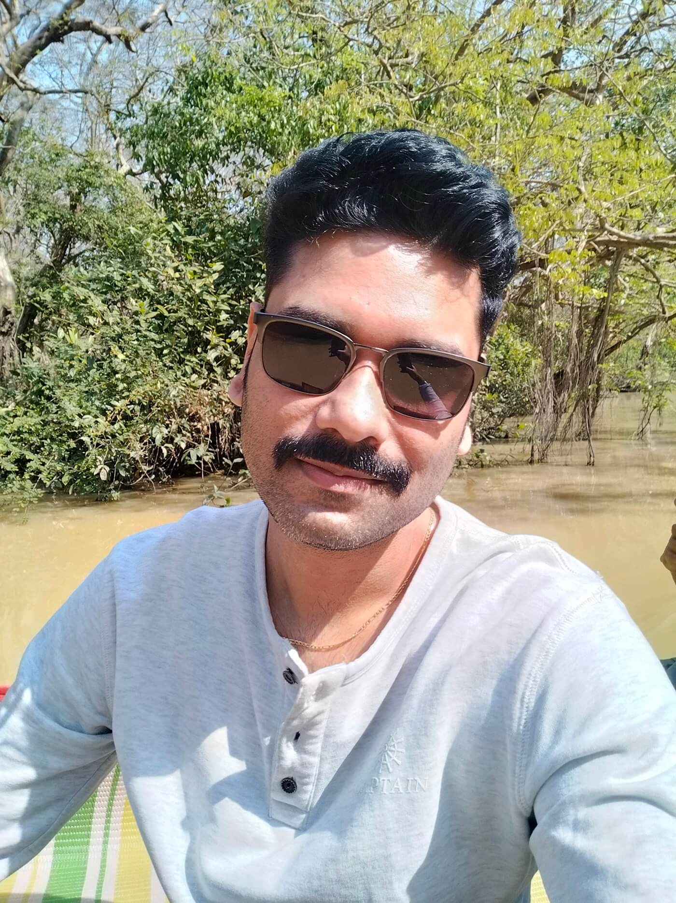

## Photos





More high res [photos in Google Drive](https://drive.google.com/drive/folders/1_P6qUCtjoYgApKHZVhtrJU4HaM8xYFNy)

## Short Bio

Tamal Anwar Chowdhury is a self-taught Bangladeshi software engineer with expertise in JavaScript, ReactJS, and NodeJS. He currently works as a software consultant and technical writer at Digital Ocean. In his free time, he enjoys creating technical content and playing chess.

**Feel free to copy paste**

```md
Tamal Anwar Chowdhury is a self-taught Bangladeshi software engineer with expertise in JavaScript, ReactJS, and NodeJS. He currently works as a software consultant and technical writer at Digital Ocean. In his free time, he enjoys creating technical content and playing chess.
```


## Long Bio

Tamal Anwar Chowdhury is a software engineer from Bangladesh who loves to create things. He's a self-taught developer and studied computer science in college. Tamal uses JavaScript, ReactJS, and NodeJS to build software.

Tamal is currently a software consultant at a freight company in Singapore and also works as a technical writer at Digital Ocean. When he's not working, he enjoys making technical articles on his blog, tamalweb.com, and producing videos about technology. Tamal is very active in his local developer community and goes to meetups.

In his free time, Tamal likes to watch funny YouTube videos with his siblings. He's also recently gotten into playing chess and has an ELO rating of 1200 on Chess.com.

**Feel free to copy paste**

```md
Tamal Anwar Chowdhury is a software engineer from Bangladesh who loves to create things. He's a self-taught developer and studied computer science in college. Tamal uses JavaScript, ReactJS, and NodeJS to build software.

Tamal is currently a software consultant at a freight company in Singapore and also works as a technical writer at Digital Ocean. When he's not working, he enjoys making technical articles on his blog, tamalweb.com, and producing videos about technology. Tamal is very active in his local developer community and goes to meetups.

In his free time, Tamal likes to watch funny YouTube videos with his siblings. He's also recently gotten into playing chess and has an ELO rating of 1200 on Chess.com.
```
